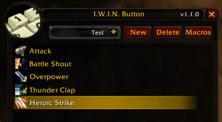

# EasyPrio

**Priority-based macro automation for Turtle WoW**

Because manually tracking cooldowns is for tryhards and we're here to be comfortably lazy. 😎

This addon allows you to set up intelligent spell priority lists with a single button press:
- Choose the order and conditions for using abilities
- Add self-buffs to your button setup – no more worrying about missing buffs  
- Debuffs in your rotation will be refreshed as soon as they expire
- Create different rotations for single-target damage, AoE, farming, and more

The addon doesn't just cast abilities in a fixed order.
When you press the macro button, it checks for relevant buffs/debuffs, available energy/rage/mana, and whether the spell can be cast.
Built with a modular class system for easy maintenance and contributions.

**Originally based on IWINButton by Murashko, enhanced with modern improvements.**

### Creating Your First Button

|#  | Action | Screenshot |
|---|---|---|
|1. | After installing the addon, an "EasyPrio" button will appear in your SpellBook. Click it to open the main addon window. ||
|2. | To create a new rotation, click **New** and enter a name. ||
|3. | Add desired spells from your SpellBook by clicking them while holding Ctrl+Shift. ||
|4. | Settings for the selected spell (if available) will appear below the list. ||
|5. | It's important to also drag the selected spells from the SpellBook to your action bar. ||
|6. | Next, click **Macros** and drag it to your action bar. This creates a macro for your current character. You can change the icon if you wish. The macro will also appear in your game's Macro UI, where you can further customize its icon and name just like any other macro. ||
|7. | Done!||

## Installation

1. Download the latest release from GitHub
2. Extract to `World of Warcraft\_retail_\Interface\AddOns\EasyPrio\`  
3. Enable in your addon manager
4. Restart WoW or reload UI

## Credits

Originally based on **IWINButton** by Murashko, maintained by Steelbash. Enhanced with modular class system and improved UI.

## License

MIT License - Feel free to fork, modify, and contribute!

---

###### Warning! This addon may be addictive and cause severe laziness.
