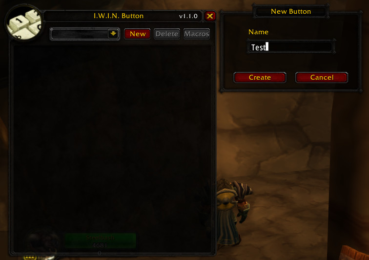
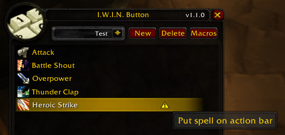

# I.W.I.N Button
Addon for **Turtle WoW**

This addon allows you to set up a rotation to cast abilities with a single button press:
- Choose the order and conditions for using abilities
- Add self-buffs to your button setup – no more worrying about missing buffs
- Debuffs in your rotation will be refreshed as soon as they expire
- Create different rotations for single-target damage, AoE, farming, and more

The addon doesn't just cast abilities in a fixed order.
When you press the macro button, it checks for relevant buffs/debuffs, available energy/rage/mana, and whether the spell can be cast.
Modern AI techniques were used in the creation of this addon to let you enjoy the game instead of frantically tracking cooldowns.

### Creating Your First Button

|#  | Action | Screenshot |
|---|---|---|
|1. | After installing the addon, a button will appear in your SpellBook. Click it to open the main addon window. ||
|2. | To create a new rotation, click **New** and enter a name. ||
|3. | Add desired spells from your SpellBook by clicking them while holding Ctrl+Shift. ||
|4. | Settings for the selected spell (if available) will appear below the list. ||
|5. | It's important to also drag the selected spells from the SpellBook to your action bar. ||
|6. | Next, click **Macros** and drag it to your action bar. This creates a macro for your current character. You can change the icon if you wish. ||
|7. | Done!||

###### Warning! This addon may be addictive.
